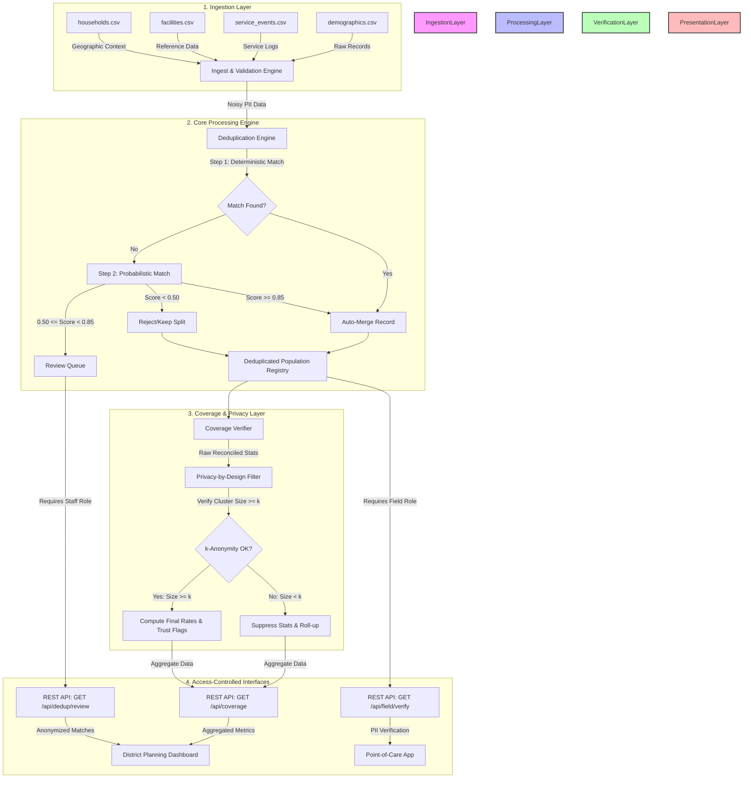

# Architecture Design

This document details the system components, data ingestion pipeline, deduplication flow, and the strict PII (Personally Identifiable Information) boundaries implemented to enforce privacy-by-design.

---

## 1. System Data Flow Diagram

The diagram below illustrates how data is ingested, processed, and served. Notice the strict boundary where identifiable client data (PII) is isolated and prevented from reaching planning interfaces.

---

## 2. Privacy Boundaries & PII Flow Isolation

To prevent the profiling and stigmatization of communities:
* **The PII Boundary**: Raw client names, birth dates, precise household links, and phone numbers are strictly processed in-memory within the **Core Processing Engine**. 
* **The Database / Registry**: Detailed records are stored in the *Deduplicated Population Registry*. This registry resides on an encrypted database/file server and is not accessible to standard business intelligence tools.
* **Planning Dashboard Separation**: The dashboard receives ONLY aggregated statistics per cluster (e.g., vaccine coverage percentage, estimated count of under-vaccinated children, trust level). At no point does individual detail flow to the planning client.
* **Point-of-Care Access (Field Verification)**: A field health worker, physically visiting a household, can look up a child's record using the `GET /api/field/verify` API. This requires passing credentials simulating the `field_worker` role. The lookup is single-record based and does not allow bulk extraction of PII.

---

## 3. Component Details

1. **Ingest Engine**: Reads demographic, service, facility, and household CSV tables. Validates schema and structure.
2. **Deduplication Engine**: Resolves identity fragmentation by applying deterministic keys, then computing Jaro-Winkler string similarities, temporal birth differences, phonetic similarity (Double Metaphone), and phone Hamming distances. It outputs matching weights and links.
3. **Coverage Verifier**: Computes vaccine coverage estimates. Applies the **k-Anonymity** rule to ensure any cluster containing fewer than $k$ (default 10) children does not report individual metrics. Instead, it flags the cluster as suppressed to prevent single-family exposure.
4. **FastAPI Web Server**: Serves static frontend files and hosts JSON-REST endpoints. Implements basic token/role validation simulation to enforce authorization boundaries.
5. **Aesthetics & UI**: Modern single-page client built with HTML5, CSS3 grid/flexbox layout, visual charts (comparative bars, line targets), and dynamic review screens.
